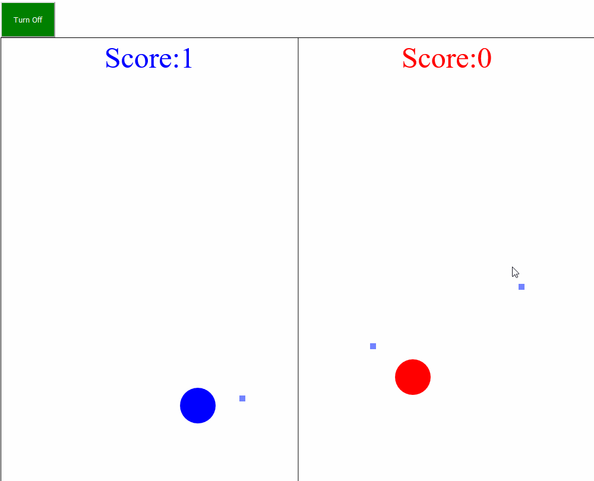

# Game Shoot

- Mini shoot Game, one or two players.

## About this project

- Inspired by a tutorial to find on the internet.

### Gameplay

launch the game : click mouse!

player red:

- direction key : up arrow, down arrow, left arrow, right arrow.
- shoot : Inser or 0

player blue:

- direction key : q, d, s, z. (keyboard azerty)
- shoot : space.

### Ia

- Active Ia (player blue) = press "Turn On"

## Game

[launch the game](https://shootgame-luc.netlify.app/).

## Screenshots

